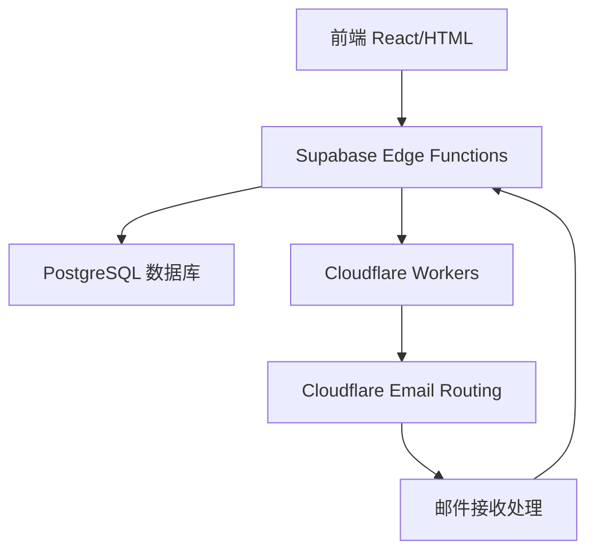

# 临时邮箱生成器 - Supabase版本

## 🎯 项目概述

这是一个基于 **Supabase Edge Functions** + **Cloudflare Workers** 的现代化临时邮箱生成器，已从 UniCloud 迁移到 Supabase 平台。

### ✨ 主要功能
- 🔄 自动生成临时邮箱地址
- 📧 实时接收和解析邮件
- 📖 邮件内容查看和管理
- 🗑️ 批量删除邮箱和邮件
- 🚀 基于现代 TypeScript/Deno 运行时

## 🏗️ 系统架构



## 🆕 Supabase 迁移亮点

### 从 UniCloud 到 Supabase 的优势：
- ✅ **现代化技术栈**：TypeScript + Deno 替代 Node.js
- ✅ **更好的性能**：PostgreSQL + 优化索引
- ✅ **实时功能**：内置 WebSocket 支持（未来可扩展）
- ✅ **更好的监控**：详细的日志和指标
- ✅ **更低的成本**：更透明的价格模型
- ✅ **更强的安全性**：Row Level Security (RLS)

## 🚀 快速开始

### 方式1：使用现有部署 (推荐体验)

访问已部署的版本：[在线体验](your-deployed-url)

### 方式2：自己部署 (完整控制)

按照我们的详细部署指南：

1. **📖 [Supabase 部署指南](SUPABASE_DEPLOYMENT.md)** - 完整的部署步骤
2. **⚙️ [前端配置指南](FRONTEND_CONFIG.md)** - 前端设置说明  
3. **🧪 [测试指南](TESTING_GUIDE.md)** - 验证功能是否正常

## 📋 部署前准备

### 必需账号
- [Supabase 账号](https://supabase.com) (免费额度充足)
- [Cloudflare 账号](https://cloudflare.com) (免费版即可)
- 一个域名 (托管在 Cloudflare)

### 技术要求
- Node.js 16+ 
- Supabase CLI
- 基础的 SQL 和 JavaScript 知识

## 🏃‍♂️ 快速部署步骤

### 1. 设置 Supabase 项目
```bash
# 创建新项目并获取 URL 和 API 密钥
# 在 Supabase Dashboard 完成
```

### 2. 部署数据库架构
```sql
-- 运行 supabase/migrations/001_initial_schema.sql
-- 在 Supabase SQL Editor 中执行
```

### 3. 部署 Edge Functions
```bash
npm install -g supabase
supabase link --project-ref your-project
supabase functions deploy
```

### 4. 配置前端
```javascript
// 更新 前端/script.js 中的配置
const SUPABASE_CONFIG = {
    url: 'https://your-project.supabase.co',
    anonKey: 'your-anon-key'
};
```

### 5. 测试功能
按照 [测试指南](TESTING_GUIDE.md) 验证所有功能正常工作。

## 📁 项目结构

```
eduEmail-cloudflare/
├── supabase/
│   ├── functions/                 # Edge Functions (TypeScript)
│   │   ├── generate-email/
│   │   ├── post-cloudflare-email/
│   │   ├── get-cloudflare-email/
│   │   ├── get-all-temp-emails/
│   │   └── delete-temp-email/
│   └── migrations/               # 数据库迁移
│       └── 001_initial_schema.sql
├── 前端/                          # 前端文件
│   ├── index.html
│   ├── script.js                 # 已更新支持 Supabase
│   └── style.css
├── cloudfare-workers后端/         # Cloudflare Workers
├── SUPABASE_DEPLOYMENT.md        # 部署指南
├── TESTING_GUIDE.md             # 测试指南
├── FRONTEND_CONFIG.md           # 前端配置
└── .env.example                 # 环境变量示例
```

## 🔧 API 端点

### Supabase Edge Functions
- `POST /functions/v1/generate-email` - 生成临时邮箱
- `POST /functions/v1/get-cloudflare-email` - 获取邮件
- `POST /functions/v1/delete-temp-email` - 删除邮箱
- `POST /functions/v1/get-all-temp-emails` - 获取所有邮箱
- `POST /functions/v1/post-cloudflare-email` - 存储邮件 (Worker 调用)

## 🔐 安全特性

- **Row Level Security (RLS)**：数据库级别的权限控制
- **API 密钥管理**：分离的匿名和服务角色密钥
- **CORS 配置**：防止跨站请求伪造
- **环境变量**：敏感配置安全存储

## 📊 监控和日志

### Supabase Dashboard
- Edge Function 调用日志
- 数据库查询性能
- 实时指标监控
- 错误报告和警报

### Cloudflare Dashboard  
- Worker 执行日志
- 邮件路由状态
- API 调用统计

## 🐛 故障排除

### 常见问题
1. **CORS 错误** - 检查 Supabase CORS 设置
2. **认证失败** - 验证 API 密钥配置
3. **邮件接收失败** - 检查 Cloudflare 邮件路由
4. **函数超时** - 增加函数超时设置

详细解决方案请参考 [测试指南](TESTING_GUIDE.md)。

## 🤝 贡献指南

我们欢迎贡献！请遵循以下步骤：

1. Fork 项目
2. 创建功能分支 (`git checkout -b feature/AmazingFeature`)
3. 提交更改 (`git commit -m 'Add AmazingFeature'`)
4. 推送到分支 (`git push origin feature/AmazingFeature`)
5. 开启 Pull Request

## 📞 获取帮助

- 📖 **文档**：查看我们的详细指南
- 🐛 **Bug 报告**：[提交 Issue](https://github.com/yujingcheong/eduEmail-cloudflare/issues)
- 💡 **功能建议**：[讨论区](https://github.com/yujingcheong/eduEmail-cloudflare/discussions)
- 📧 **直接联系**：[开发者邮箱]

## 📄 许可证

本项目采用 MIT 许可证 - 详见 [LICENSE](LICENSE) 文件。

## 🙏 致谢

- [Supabase](https://supabase.com) - 现代化的后端即服务平台
- [Cloudflare](https://cloudflare.com) - 邮件路由和 Workers 服务  
- 原 UniCloud 版本的所有贡献者

---

## 🔄 迁移说明

如果你正在从旧的 UniCloud 版本迁移，请查看：
- [迁移指南](MIGRATION_GUIDE_SUPABASE.md) - 详细的迁移步骤
- [部署指南](SUPABASE_DEPLOYMENT.md) - 新版本部署

**迁移后你将获得更现代、更可靠、更易维护的系统！**

1. 登录 [Cloudflare Dashboard](https://dash.cloudflare.com/)
2. 点击右上角头像 → "My Profile"
3. 选择 "API Tokens" 标签
4. 点击 "Create Token"
5. 选择 "Custom token" 模板
6. 配置权限：
   ```
   Token name: Email-Routing-API
   Permissions:
   - Zone:Zone:Read
   - Zone:Email Routing Rules:Edit
   - Zone:Zone Settings:Edit
   - Account：Workers Scripts：Edit

   Account Resources: Include - All accounts
   Zone Resources: Include - Specific zone - [你的域名]
   ```
7. 点击 "Continue to summary" → "Create Token"
8. **重要：复制并保存生成的 Token**

### 1.2 获取 Zone ID

1. 在 Cloudflare Dashboard 中选择你的域名
2. 在右侧边栏找到 "Zone ID"
3. 复制并保存 Zone ID

### 1.3 启用 Email Routing

1. 在域名管理页面，点击左侧 "Email" → "Email Routing"
2. 点击 "Enable Email Routing"
3. 按照提示添加 MX 记录到你的域名
4. 等待 DNS 记录生效（通常几分钟）

### 1.4 创建 Cloudflare Worker

1. 在 Cloudflare Dashboard 中，点击 "Workers & Pages"
2. 点击 "Create application" → "Create Worker"
3. 输入 Worker 名称（例如：`email-processor`）
4. 点击 "Deploy"
5. 记录 Worker 名称，后续配置需要用到

### 1.5 配置 Worker 代码

1. 在 Worker 编辑页面，将 `cloudfare-workers后端/workers.js` 的内容复制到编辑器中
2. 点击 "Save and Deploy"

## 第二步：UniCloud 云函数部署

### 2.1 创建 UniCloud 项目

1. 登录 [UniCloud 控制台](https://unicloud.dcloud.net.cn/)
2. 创建新项目或使用现有项目
3. 记录项目的云函数访问域名

### 2.2 部署云函数

需要部署以下 4 个云函数：

#### 2.2.1 generate-email 云函数

1. 创建云函数 `generate-email`
2. 将 `uniCloud/cloudfunctions/generate-email/index.js` 内容复制到云函数中
3. **重要：修改配置信息**：
   ```javascript
   const config = {
     cloudflare: {
       api_token: "你的_CLOUDFLARE_API_TOKEN",
       zone_id: "你的_ZONE_ID", 
       domain: "你的域名"
     },
     workers: {
       worker_name: "你的_WORKER_名称",
       worker_route: "你的域名",
       use_worker_first: true
     }
   };
   ```
4. 安装依赖：在云函数根目录创建 `package.json`：
   ```json
   {
     "name": "generate-email",
     "version": "1.0.0",
     "dependencies": {
       "axios": "^1.6.0"
     }
   }
   ```
5. 上传并部署

#### 2.2.2 GET_cloudflare_edukg_email 云函数

1. 创建云函数 `GET_cloudflare_edukg_email`
2. 将对应的 `index.js` 内容复制到云函数中
3. 上传并部署

#### 2.2.3 GET_all_temp_emails 云函数

1. 创建云函数 `GET_all_temp_emails`
2. 将对应的 `index.js` 内容复制到云函数中
3. **修改配置信息**：
   ```javascript
   const config = {
     cloudflare: {
       api_token: "你的_CLOUDFLARE_API_TOKEN",
       zone_id: "你的_ZONE_ID",
       domain: "你的域名"
     }
   };
   ```
4. 安装 axios 依赖
5. 上传并部署

#### 2.2.4 Delete_edu_cloudfare 云函数

1. 创建云函数 `Delete_edu_cloudfare`
2. 将对应的 `index.js` 内容复制到云函数中
3. **修改配置信息**（同上）
4. 安装 axios 依赖
5. 上传并部署

#### 2.2.5 POST_cloudflare_edukg_email 云函数

这个云函数用于接收 Worker 发送的邮件数据：

1. 创建云函数 `POST_cloudflare_edukg_email`
2. 创建以下代码：
   ```javascript
   'use strict';

   exports.main = async (event, context) => {
     console.log('=== 接收邮件数据 ===');
     console.log('接收到的数据:', JSON.stringify(event, null, 2));
     
     try {
       const { emailInfo, emailContent } = event;
       
       if (!emailInfo || !emailContent) {
         throw new Error('邮件数据格式错误');
       }
       
       // 保存到数据库
       const db = uniCloud.database();
       const result = await db.collection('cloudflare_edukg_email').add({
         emailFrom: emailInfo.from,
         emailTo: emailInfo.to,
         emailSubject: emailInfo.subject,
         emailDate: emailInfo.date,
         emailText: emailContent.text,
         emailHtml: emailContent.html,
         emailType: emailInfo.hasHtml ? 'html' : 'text',
         createTime: Date.now()
       });
       
       console.log('邮件保存成功:', result);
       
       return {
         success: true,
         message: '邮件保存成功',
         insertedId: result.id
       };
     } catch (error) {
       console.error('保存邮件失败:', error);
       return {
         success: false,
         error: error.message
       };
     }
   };
   ```
3. 上传并部署

### 2.3 配置数据库集合

在 UniCloud 控制台中创建以下数据库集合：

1. `temp_emails` - 存储临时邮箱记录
2. `cloudflare_edukg_email` - 存储邮件内容

## 第三步：前端部署

### 3.1 修改前端配置

编辑 `前端/script.js`，修改云函数访问地址：

```javascript
// 将所有云函数 URL 替换为你的实际地址
const CLOUD_FUNCTION_BASE_URL = 'https://你的项目域名.dev-hz.cloudbasefunction.cn';

// 例如：
// '云函数链接generate-email'
// 替换为：
// 'https://你的项目域名.dev-hz.cloudbasefunction.cn/generate-email'
```

### 3.2 部署前端

1. 将 `前端` 目录下的所有文件上传到你的 Web 服务器
2. 或者使用 GitHub Pages、Vercel、Netlify 等静态托管服务

## 第四步：配置邮件路由

### 4.1 更新 Worker 配置

在 Cloudflare Worker 中，确保 `callUniCloudFunction` 方法中的云函数 URL 正确：

```javascript
const cloudFunctionUrl = 'https://你的项目域名.dev-hz.cloudbasefunction.cn/POST_cloudflare_edukg_email';
```

### 4.2 测试邮件路由

1. 使用前端生成一个临时邮箱
2. 向该邮箱发送测试邮件
3. 检查 Worker 日志和云函数日志
4. 确认邮件是否正确保存到数据库

## 第五步：域名和 SSL 配置

### 5.1 配置自定义域名（可选）

如果要使用自定义域名访问前端：

1. 在域名 DNS 中添加 A 记录或 CNAME 记录
2. 配置 SSL 证书
3. 更新 CORS 配置

### 5.2 更新 CORS 配置

在所有云函数中，确保 CORS 配置包含你的前端域名：

```javascript
static setCorsHeaders(origin, additionalHeaders = {}) {
  return {
    'Content-Type': 'application/json',
    'Access-Control-Allow-Origin': origin, // 或指定具体域名
    'Access-Control-Allow-Methods': 'GET, POST, PUT, DELETE, OPTIONS',
    'Access-Control-Allow-Headers': 'Content-Type, Authorization, X-Requested-With, Accept, Origin',
    'Access-Control-Allow-Credentials': 'true',
    'Access-Control-Max-Age': '86400',
    ...additionalHeaders
  };
}
```

## 配置文件汇总

### Cloudflare 配置
- **API Token**: 在 Cloudflare Profile → API Tokens 中创建
- **Zone ID**: 在域名管理页面右侧边栏获取
- **Worker 名称**: 创建 Worker 时设置的名称
- **域名**: 你的实际域名

### UniCloud 配置
- **云函数域名**: 在 UniCloud 控制台获取
- **数据库集合**: `temp_emails`, `cloudflare_edukg_email`

## 常见问题排查

### 1. 邮件接收不到
- 检查 MX 记录是否正确配置
- 确认 Email Routing 已启用
- 查看 Worker 日志是否有错误

### 2. API 调用失败
- 检查 API Token 权限是否正确
- 确认 Zone ID 是否匹配
- 查看是否触发了 API 限制（429 错误）

### 3. 云函数调用失败
- 检查云函数 URL 是否正确
- 确认 CORS 配置是否包含前端域名
- 查看云函数日志排查具体错误

### 4. 数据库操作失败
- 确认数据库集合是否已创建
- 检查数据格式是否正确
- 查看云函数权限配置

## 安全建议

1. **API Token 安全**：
   - 不要在前端代码中暴露 API Token
   - 定期轮换 API Token
   - 使用最小权限原则

2. **访问控制**：
   - 配置适当的 CORS 策略
   - 考虑添加访问频率限制
   - 监控异常访问

3. **数据保护**：
   - 定期清理过期邮件数据
   - 考虑对敏感邮件内容加密
   - 备份重要配置信息

## 监控和维护

1. **日志监控**：
   - 定期检查 Worker 日志
   - 监控云函数执行情况
   - 关注错误率和响应时间

2. **性能优化**：
   - 监控 API 调用频率
   - 优化数据库查询
   - 考虑添加缓存机制

3. **定期维护**：
   - 清理过期的临时邮箱
   - 更新依赖包版本
   - 备份重要数据

## 开源许可

本项目采用 MIT 许可证，欢迎贡献代码和提出改进建议。

## 联系方式

如有问题或建议，请通过以下方式联系：
- GitHub Issues
- 微信：[
]

---

**注意**：部署前请仔细阅读本文档，确保所有配置信息正确填写。建议先在测试环境中验证功能正常后再部署到生产环境。


