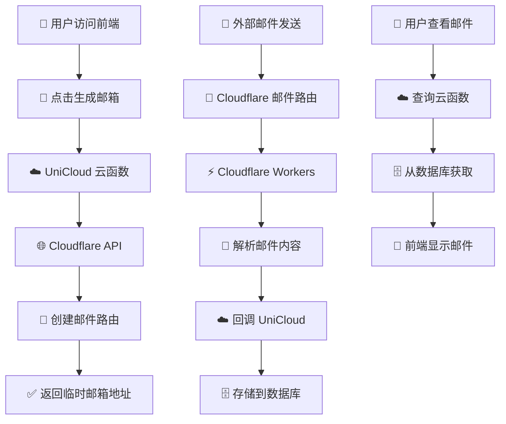

# 📧 临时邮箱生成器 - eduEmail-cloudflare

> 🚀 一键生成安全的临时邮箱地址，基于 Cloudflare Workers + UniCloud 的完整解决方案

## 🎯 快速开始

| 🔗 快速链接 | 📝 说明 | ⏱️ 预计时间 |
|------------|--------|------------|
| **[🌟 项目概览](./PROJECT_OVERVIEW.md)** | 了解项目特性、架构和优势 | 3分钟 |
| **[📖 详细设置流程](./SETUP_GUIDE.md)** | 完整的分步设置指南，包含所有必要链接 | 45分钟 |
| **[⚡ 快速检查清单](./QUICK_CHECKLIST.md)** | 一页纸设置检查清单，适合快速参考 | 5分钟 |
| **[🔧 故障排查指南](./TROUBLESHOOTING.md)** | 常见问题解决方案 | 按需阅读 |
| **[🌐 Cloudflare Dashboard](https://dash.cloudflare.com/)** | 配置域名、API Token、Workers | 15分钟 |
| **[☁️ UniCloud 控制台](https://unicloud.dcloud.net.cn/)** | 部署云函数、管理数据库 | 20分钟 |
| **[🔧 API Token 创建](https://dash.cloudflare.com/profile/api-tokens)** | 直达 API Token 创建页面 | 2分钟 |

## 📊 系统架构流程



## 🏗️ 项目特性

- ✅ **一键生成** - 即时创建临时邮箱地址
- ✅ **实时接收** - 自动接收并解析邮件内容  
- ✅ **安全可靠** - 基于 Cloudflare 企业级基础设施
- ✅ **无需注册** - 无需提供真实邮箱或个人信息
- ✅ **支持格式** - HTML 和纯文本邮件完美支持
- ✅ **批量管理** - 支持查看、删除多个临时邮箱
- ✅ **响应式** - 完美适配桌面端和移动端

## 📱 已部署示例

### 微信小程序版本（推荐）


> ⚠️ 注意：小程序版本每日限制5次生成，如生成失败请再次点击（网络延迟导致）

### Web 版本


## 🚀 快速部署流程

### 方式一：完整自部署 ⭐ 推荐
按照 **[详细设置流程指南](./SETUP_GUIDE.md)** 进行完整部署，大约需要 45 分钟，但可以完全自主控制。

### 方式二：小程序快速体验
扫描上方小程序二维码，立即体验功能（每日限制5次）。

---

## 🛠️ 相关项目

### 编程工具推荐
- **AI公众号自动发文助手**：[AI写作自动化工具](https://github.com/wojiadexiaoming-copy/AIWeChatauto.git)
- **编程软件多开器**：[Cursor等IDE多开工具](https://github.com/wojiadexiaoming-copy/cursor_vip) | [演示视频](https://www.douyin.com/user/self?modal_id=7539884476013301007)

### 教程资源
- **Augment 注册教程**：[完整图文教程](https://mp.weixin.qq.com/s/dZVp-ccPFm771CfCTkrL_w)

## 📋 完整部署指南

> 👥 **适合人群**：有一定技术基础，希望完全掌控系统的用户

### 📚 文档导航

| 📄 文档 | 🎯 适用场景 | ⏱️ 阅读时间 |
|---------|------------|------------|
| **[📖 详细设置流程](./SETUP_GUIDE.md)** | 第一次部署，需要详细指导 | 10-15分钟 |
| **[⚡ 快速检查清单](./QUICK_CHECKLIST.md)** | 快速参考，确认设置步骤 | 2-3分钟 |
| **[🔧 故障排查指南](./TROUBLESHOOTING.md)** | 遇到问题时查阅 | 按需阅读 |
| **[📋 下方技术文档](#技术实现详情)** | 了解技术细节和原理 | 5-10分钟 |

### 🛠️ 核心服务快速访问

| 🔗 服务入口 | 📝 主要功能 | 💡 使用提示 |
|------------|------------|------------|
| **[Cloudflare Dashboard](https://dash.cloudflare.com/)** | 域名、DNS、Workers 管理 | 建议保持登录状态 |
| **[API Token 管理](https://dash.cloudflare.com/profile/api-tokens)** | 创建和管理 API 访问权限 | 妥善保存生成的 Token |
| **[Workers 控制台](https://dash.cloudflare.com/workers)** | 部署和管理邮件处理脚本 | 注意查看执行日志 |
| **[UniCloud 腾讯云](https://console.cloud.tencent.com/tcb)** | 云函数和数据库管理 | 推荐版本，稳定性好 |
| **[UniCloud DCloud](https://unicloud.dcloud.net.cn/)** | 备选云函数平台 | 可选择阿里云版本 |

---

# 📋 技术实现详情

## 项目概述

这是一个基于 Cloudflare Workers + UniCloud 云函数的临时邮箱生成器项目，支持：
- 自动生成临时邮箱地址
- 实时接收和解析邮件
- 邮件内容查看和管理
- 批量删除邮箱和邮件

## 系统架构

```
前端 (HTML/CSS/JS) 
    ↓
UniCloud 云函数 (Node.js)
    ↓
Cloudflare Workers (邮件处理)
    ↓
Cloudflare Email Routing (邮件路由)
```

## 部署前准备

### 1. 域名准备
- 需要一个域名
- 域名需要托管在 Cloudflare 上

### 2. 账号准备
- Cloudflare 账号
- UniCloud 账号（阿里云/腾讯云/支付宝云）

## 第一步：Cloudflare 配置

### 1.1 获取 Cloudflare API Token

1. 登录 [Cloudflare Dashboard](https://dash.cloudflare.com/)
2. 点击右上角头像 → "My Profile"
3. 选择 "API Tokens" 标签
4. 点击 "Create Token"
5. 选择 "Custom token" 模板
6. 配置权限：
   ```
   Token name: Email-Routing-API
   Permissions:
   - Zone:Zone:Read
   - Zone:Email Routing Rules:Edit
   - Zone:Zone Settings:Edit
   - Account：Workers Scripts：Edit

   Account Resources: Include - All accounts
   Zone Resources: Include - Specific zone - [你的域名]
   ```
7. 点击 "Continue to summary" → "Create Token"
8. **重要：复制并保存生成的 Token**

### 1.2 获取 Zone ID

1. 在 Cloudflare Dashboard 中选择你的域名
2. 在右侧边栏找到 "Zone ID"
3. 复制并保存 Zone ID

### 1.3 启用 Email Routing

1. 在域名管理页面，点击左侧 "Email" → "Email Routing"
2. 点击 "Enable Email Routing"
3. 按照提示添加 MX 记录到你的域名
4. 等待 DNS 记录生效（通常几分钟）

### 1.4 创建 Cloudflare Worker

1. 在 Cloudflare Dashboard 中，点击 "Workers & Pages"
2. 点击 "Create application" → "Create Worker"
3. 输入 Worker 名称（例如：`email-processor`）
4. 点击 "Deploy"
5. 记录 Worker 名称，后续配置需要用到

### 1.5 配置 Worker 代码

1. 在 Worker 编辑页面，将 `cloudfare-workers后端/workers.js` 的内容复制到编辑器中
2. 点击 "Save and Deploy"

## 第二步：UniCloud 云函数部署

### 2.1 创建 UniCloud 项目

1. 登录 [UniCloud 控制台](https://unicloud.dcloud.net.cn/)
2. 创建新项目或使用现有项目
3. 记录项目的云函数访问域名

### 2.2 部署云函数

需要部署以下 4 个云函数：

#### 2.2.1 generate-email 云函数

1. 创建云函数 `generate-email`
2. 将 `uniCloud/cloudfunctions/generate-email/index.js` 内容复制到云函数中
3. **重要：修改配置信息**：
   ```javascript
   const config = {
     cloudflare: {
       api_token: "你的_CLOUDFLARE_API_TOKEN",
       zone_id: "你的_ZONE_ID", 
       domain: "你的域名"
     },
     workers: {
       worker_name: "你的_WORKER_名称",
       worker_route: "你的域名",
       use_worker_first: true
     }
   };
   ```
4. 安装依赖：在云函数根目录创建 `package.json`：
   ```json
   {
     "name": "generate-email",
     "version": "1.0.0",
     "dependencies": {
       "axios": "^1.6.0"
     }
   }
   ```
5. 上传并部署

#### 2.2.2 GET_cloudflare_edukg_email 云函数

1. 创建云函数 `GET_cloudflare_edukg_email`
2. 将对应的 `index.js` 内容复制到云函数中
3. 上传并部署

#### 2.2.3 GET_all_temp_emails 云函数

1. 创建云函数 `GET_all_temp_emails`
2. 将对应的 `index.js` 内容复制到云函数中
3. **修改配置信息**：
   ```javascript
   const config = {
     cloudflare: {
       api_token: "你的_CLOUDFLARE_API_TOKEN",
       zone_id: "你的_ZONE_ID",
       domain: "你的域名"
     }
   };
   ```
4. 安装 axios 依赖
5. 上传并部署

#### 2.2.4 Delete_edu_cloudfare 云函数

1. 创建云函数 `Delete_edu_cloudfare`
2. 将对应的 `index.js` 内容复制到云函数中
3. **修改配置信息**（同上）
4. 安装 axios 依赖
5. 上传并部署

#### 2.2.5 POST_cloudflare_edukg_email 云函数

这个云函数用于接收 Worker 发送的邮件数据：

1. 创建云函数 `POST_cloudflare_edukg_email`
2. 创建以下代码：
   ```javascript
   'use strict';

   exports.main = async (event, context) => {
     console.log('=== 接收邮件数据 ===');
     console.log('接收到的数据:', JSON.stringify(event, null, 2));
     
     try {
       const { emailInfo, emailContent } = event;
       
       if (!emailInfo || !emailContent) {
         throw new Error('邮件数据格式错误');
       }
       
       // 保存到数据库
       const db = uniCloud.database();
       const result = await db.collection('cloudflare_edukg_email').add({
         emailFrom: emailInfo.from,
         emailTo: emailInfo.to,
         emailSubject: emailInfo.subject,
         emailDate: emailInfo.date,
         emailText: emailContent.text,
         emailHtml: emailContent.html,
         emailType: emailInfo.hasHtml ? 'html' : 'text',
         createTime: Date.now()
       });
       
       console.log('邮件保存成功:', result);
       
       return {
         success: true,
         message: '邮件保存成功',
         insertedId: result.id
       };
     } catch (error) {
       console.error('保存邮件失败:', error);
       return {
         success: false,
         error: error.message
       };
     }
   };
   ```
3. 上传并部署

### 2.3 配置数据库集合

在 UniCloud 控制台中创建以下数据库集合：

1. `temp_emails` - 存储临时邮箱记录
2. `cloudflare_edukg_email` - 存储邮件内容

## 第三步：前端部署

### 3.1 修改前端配置

编辑 `前端/script.js`，修改云函数访问地址：

```javascript
// 将所有云函数 URL 替换为你的实际地址
const CLOUD_FUNCTION_BASE_URL = 'https://你的项目域名.dev-hz.cloudbasefunction.cn';

// 例如：
// '云函数链接generate-email'
// 替换为：
// 'https://你的项目域名.dev-hz.cloudbasefunction.cn/generate-email'
```

### 3.2 部署前端

1. 将 `前端` 目录下的所有文件上传到你的 Web 服务器
2. 或者使用 GitHub Pages、Vercel、Netlify 等静态托管服务

## 第四步：配置邮件路由

### 4.1 更新 Worker 配置

在 Cloudflare Worker 中，确保 `callUniCloudFunction` 方法中的云函数 URL 正确：

```javascript
const cloudFunctionUrl = 'https://你的项目域名.dev-hz.cloudbasefunction.cn/POST_cloudflare_edukg_email';
```

### 4.2 测试邮件路由

1. 使用前端生成一个临时邮箱
2. 向该邮箱发送测试邮件
3. 检查 Worker 日志和云函数日志
4. 确认邮件是否正确保存到数据库

## 第五步：域名和 SSL 配置

### 5.1 配置自定义域名（可选）

如果要使用自定义域名访问前端：

1. 在域名 DNS 中添加 A 记录或 CNAME 记录
2. 配置 SSL 证书
3. 更新 CORS 配置

### 5.2 更新 CORS 配置

在所有云函数中，确保 CORS 配置包含你的前端域名：

```javascript
static setCorsHeaders(origin, additionalHeaders = {}) {
  return {
    'Content-Type': 'application/json',
    'Access-Control-Allow-Origin': origin, // 或指定具体域名
    'Access-Control-Allow-Methods': 'GET, POST, PUT, DELETE, OPTIONS',
    'Access-Control-Allow-Headers': 'Content-Type, Authorization, X-Requested-With, Accept, Origin',
    'Access-Control-Allow-Credentials': 'true',
    'Access-Control-Max-Age': '86400',
    ...additionalHeaders
  };
}
```

## 配置文件汇总

### Cloudflare 配置
- **API Token**: 在 Cloudflare Profile → API Tokens 中创建
- **Zone ID**: 在域名管理页面右侧边栏获取
- **Worker 名称**: 创建 Worker 时设置的名称
- **域名**: 你的实际域名

### UniCloud 配置
- **云函数域名**: 在 UniCloud 控制台获取
- **数据库集合**: `temp_emails`, `cloudflare_edukg_email`

## 常见问题排查

### 1. 邮件接收不到
- 检查 MX 记录是否正确配置
- 确认 Email Routing 已启用
- 查看 Worker 日志是否有错误

### 2. API 调用失败
- 检查 API Token 权限是否正确
- 确认 Zone ID 是否匹配
- 查看是否触发了 API 限制（429 错误）

### 3. 云函数调用失败
- 检查云函数 URL 是否正确
- 确认 CORS 配置是否包含前端域名
- 查看云函数日志排查具体错误

### 4. 数据库操作失败
- 确认数据库集合是否已创建
- 检查数据格式是否正确
- 查看云函数权限配置

## 安全建议

1. **API Token 安全**：
   - 不要在前端代码中暴露 API Token
   - 定期轮换 API Token
   - 使用最小权限原则

2. **访问控制**：
   - 配置适当的 CORS 策略
   - 考虑添加访问频率限制
   - 监控异常访问

3. **数据保护**：
   - 定期清理过期邮件数据
   - 考虑对敏感邮件内容加密
   - 备份重要配置信息

## 监控和维护

1. **日志监控**：
   - 定期检查 Worker 日志
   - 监控云函数执行情况
   - 关注错误率和响应时间

2. **性能优化**：
   - 监控 API 调用频率
   - 优化数据库查询
   - 考虑添加缓存机制

3. **定期维护**：
   - 清理过期的临时邮箱
   - 更新依赖包版本
   - 备份重要数据

## 开源许可

本项目采用 MIT 许可证，欢迎贡献代码和提出改进建议。

## 联系方式

如有问题或建议，请通过以下方式联系：
- GitHub Issues
- 微信：[
]

---

**注意**：部署前请仔细阅读本文档，确保所有配置信息正确填写。建议先在测试环境中验证功能正常后再部署到生产环境。


